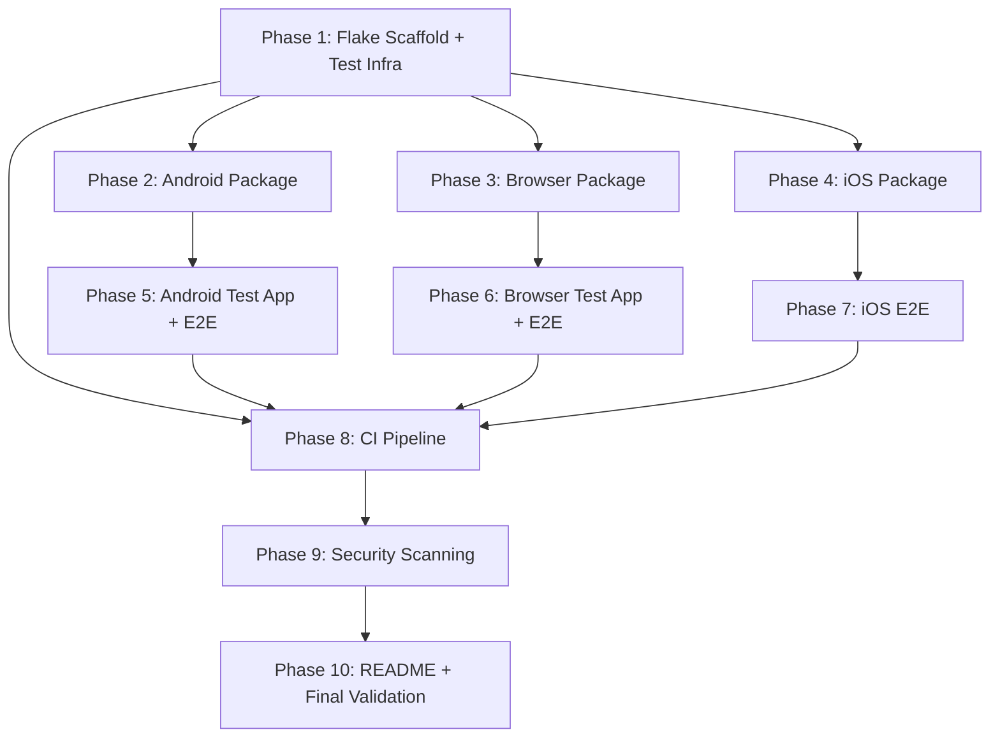

# Implementation Plan — nix-mcp-debugkit

**Preset**: local
**Date**: 2026-04-03

## Architecture Overview

This is a Nix packaging project. The "application code" is Nix expressions, shell wrapper scripts, and test orchestrator scripts. There is no traditional application runtime — each package is a `makeWrapper`-produced shell script that delegates to an upstream MCP server.

### Stack

| Layer | Technology |
|-------|-----------|
| Build system | Nix flakes (nixpkgs-unstable) |
| Platform iteration | flake-utils |
| Python packaging | buildPythonApplication (android-mcp) |
| Node packaging | buildNpmPackage (browser, iOS) |
| Android test app | androidenv (Java, minSdk 28, targetSdk 34) |
| Web test app | Static HTML/CSS/JS |
| Test orchestration | Bash scripts with JSON-RPC over stdio |
| Linting | statix, deadnix, shellcheck |
| Security | Gitleaks, Trivy, Semgrep, Snyk, SonarCloud |
| CI | GitHub Actions (Linux KVM + macOS) |

### Project Structure

```
nix-mcp-debugkit/
├── flake.nix                    # Top-level flake: packages, checks, devShells, overlays
├── flake.lock
├── android/
│   ├── default.nix              # mcp-android package (buildPythonApplication)
│   └── check.sh                 # --check pre-flight script
├── ios/
│   ├── default.nix              # mcp-ios package (buildNpmPackage, darwin-only)
│   └── check.sh                 # --check pre-flight script
├── browser/
│   ├── default.nix              # mcp-browser package (buildNpmPackage + playwright)
│   └── check.sh                 # --check pre-flight script
├── test-apps/
│   ├── android/
│   │   ├── default.nix          # Builds APK via androidenv
│   │   └── app/
│   │       ├── AndroidManifest.xml
│   │       ├── build.gradle
│   │       └── src/main/java/com/nixmcpdebugkit/testapp/MainActivity.java
│   └── web/
│       ├── default.nix          # Packages static site directory
│       ├── index.html           # Counter page: button, counter label, text input, scrollable list
│       └── page2.html           # Second page (link navigation test)
├── tests/
│   ├── common.sh                # Shared: wait_for, assert_json, assert_eq, write_summary, mcp_call
│   ├── smoke.sh                 # Quick smoke: binaries exist, --check runs, --help works
│   ├── android-e2e.sh           # Full Android E2E with emulator
│   ├── browser-e2e.sh           # Full browser E2E (Chromium from Nix)
│   ├── browser-e2e-all.sh       # Browser E2E for Firefox + WebKit (Playwright download, CI only)
│   └── ios-e2e.sh               # Full iOS E2E with simulator (macOS only)
├── .github/
│   └── workflows/
│       └── ci.yml               # Full CI pipeline
├── .gitignore
├── PROJECT.md
├── README.md
├── LICENSE
└── specs/                       # Spec-kit artifacts (this directory)
```

---

## Phase Dependencies



### Parallel workstreams

```
Agent A: Phase 1 → Phase 2 → Phase 5 (Android path)
Agent B: Phase 1 (wait) → Phase 3 → Phase 6 (Browser path)
Agent C: Phase 1 (wait) → Phase 4 → Phase 7 (iOS path, macOS only)
Sync:    All → Phase 8 → Phase 9 → Phase 10
```

Phases 2/3/4 are fully independent once Phase 1 completes. Phases 5/6/7 are fully independent. Phase 8 (CI) needs all test orchestrators to exist.

---

## Interface Contracts (Internal)

| IC | Name | Producer | Consumer(s) | Specification |
|----|------|----------|-------------|---------------|
| IC-001 | MCP stdio protocol | Wrapper scripts | Test orchestrators | JSON-RPC 2.0 over stdin/stdout. One JSON object per line. Request: `{"jsonrpc":"2.0","id":N,"method":"tools/call","params":{...}}`. Response: `{"jsonrpc":"2.0","id":N,"result":{...}}` or `{"jsonrpc":"2.0","id":N,"error":{...}}` |
| IC-002 | Test results format | Test orchestrators (common.sh) | CI verification step | Dir: `test-logs/<target>/`, file: `summary.json` with `{"pass":N,"fail":N,"skip":N,"duration":N,"failures":["name1","name2"]}`. Per-failure: `failures/<test-name>.log` with assertion details. |
| IC-003 | --check output format | check.sh scripts | Agents, smoke tests | Stdout, line-based. Pass: `✓ <description>`. Fail: `✗ <description>` followed by `  → <remediation hint>`. Exit 0 if all pass, exit 1 if any fail. |
| IC-004 | Android test APK | test-apps/android/default.nix | android-e2e.sh | Output: `$out/test-app.apk`. Package: `com.nixmcpdebugkit.testapp`. Main activity: `.MainActivity`. UI: button (id: `btn_tap`), counter label (id: `txt_counter`, initial: "Count: 0"), text input (id: `input_text`), scrollable list (id: `list_items`, 50 items). |
| IC-005 | Web test app | test-apps/web/default.nix | browser-e2e.sh | Output: `$out/index.html` + `$out/page2.html`. index.html: button (id: `btn-tap`), counter (id: `counter`, initial: "Count: 0"), text input (id: `input-text`), link to page2.html (id: `link-page2`). page2.html: heading "Page 2" (id: `heading`). |
| IC-006 | Wrapper script PATH | */default.nix (makeWrapper) | MCP server processes | Each wrapper prepends native deps to PATH: android adds `android-tools/bin`, browser sets `PLAYWRIGHT_BROWSERS_PATH`, ios relies on system xcrun. |

---

## Testing Strategy

### Philosophy
Real servers, real emulators, real browsers. No mocks at system boundaries. The MCP servers are black-box tested: start the server, send JSON-RPC over stdin, verify responses.

### Test tiers

| Tier | What | How | When |
|------|------|-----|------|
| Smoke | Wrapper exists, is executable, `--check` runs, `--help` works | smoke.sh in nix flake check | Every build |
| Integration (Android) | Real emulator + real MCP server, exercise all tools | android-e2e.sh | nix flake check (KVM), CI |
| Integration (Browser/Chromium) | Real headless Chromium + real MCP server, exercise all tools | browser-e2e.sh | nix flake check, CI |
| Integration (Browser/Firefox+WebKit) | Playwright-downloaded browsers + MCP server | browser-e2e-all.sh | CI only (non-Nix step) |
| Integration (iOS) | Real simulator + real MCP server, exercise screenshot + tap | ios-e2e.sh | CI macOS only |

### User-flow test plans

**Flow 1: Agent debugs Android app via MCP**
Chain: wrapper starts → adb connects → MCP server initializes → agent sends screenshot command → server captures via adb → returns base64 image → agent sends click command → server taps via adb → UI updates → agent reads accessibility tree → verifies state change
Injectable seams: test APK provides deterministic UI (counter starts at 0, button always increments)
Observable output: counter label changes from "Count: 0" to "Count: 1" after click, verified via accessibility tree read

**Flow 2: Agent debugs web app via MCP**
Chain: wrapper starts → Chromium launches headless → MCP server initializes → agent sends navigate → page loads → agent sends screenshot → returns image → agent sends click on button → counter updates → agent sends fill on input → text appears → agent navigates to page2 → heading visible
Injectable seams: static HTML test app, deterministic content
Observable output: counter increments, input contains typed text, page2 heading visible

**Flow 3: Agent runs pre-flight check**
Chain: agent runs `mcp-android --check` → check.sh verifies adb binary → verifies device connected → prints structured results
Injectable seams: presence/absence of emulator
Observable output: structured check lines with ✓/✗, correct exit code

### Test plan matrix

| SC | Test Tier | Fixture | Assertion | Infrastructure |
|----|-----------|---------|-----------|----------------|
| SC-001 | Smoke | None | `nix build .#mcp-android` exits 0, output exists | Linux |
| SC-002 | Smoke | None | `nix build .#mcp-browser` exits 0, output exists | Linux |
| SC-003 | Smoke | None | `nix build .#mcp-ios` exits 0, output exists | macOS |
| SC-004 | Smoke | None | `nix eval` on Linux errors with platform message | Linux |
| SC-005 | Smoke | None | Wrapper starts, `--help` or initial handshake succeeds | Linux |
| SC-006 | Integration | Web test app | Navigate URL, screenshot returns base64 PNG | Linux, Chromium |
| SC-007 | Smoke | None | Wrapper starts on macOS | macOS |
| SC-008 | Integration | Android test APK, emulator | Screenshot + click + type + swipe + state-read all return success, counter increments | Linux, KVM |
| SC-009 | Integration | Web test app | Click button, verify counter; fill input; navigate link | Linux, Chromium |
| SC-010 | Integration | Web test app | Same as SC-009 but against Firefox and WebKit | Linux, CI-only |
| SC-011 | Integration | Stock iOS app, simulator | Screenshot + tap return success | macOS, Xcode |
| SC-012 | Integration | Emulator running / not running | --check outputs ✓/✗ correctly, exit code matches | Linux, KVM |
| SC-013 | Integration | Chromium available | --check reports version and success | Linux |
| SC-014 | Smoke | None | default package includes correct packages per platform | Linux + macOS |
| SC-015 | Integration | Test flake.nix | Overlay makes pkgs.mcp-* available | Linux |
| SC-016 | CI | All CI jobs | All jobs green, security gates block on failures | GitHub Actions |
| SC-017 | Integration | Any E2E run | test-logs/<target>/summary.json exists with pass > 0 | All |
| SC-018 | CI | Security scan jobs | Zero critical/high findings in all scanners | GitHub Actions |
| SC-019 | Integration | MCP server + extra args | Args pass through to upstream | Linux |
| SC-020 | Smoke | None | `nix build .#test-app-android` and `nix build .#test-app-web` succeed | Linux |

### Structured test output

All test orchestrators source `tests/common.sh` which provides:
- `start_test_run <target>` — creates `test-logs/<target>/` directory, records start time
- `test_pass <name>` — increments pass counter, logs one-line summary
- `test_fail <name> <details>` — increments fail counter, writes `failures/<name>.log` with assertion details
- `test_skip <name> <reason>` — increments skip counter
- `finish_test_run` — writes `summary.json`, prints summary to stdout, exits with appropriate code
- `mcp_call <method> <params>` — sends JSON-RPC to MCP server stdin, reads response, returns result
- `assert_json <json> <jq_expr> <expected>` — asserts a jq expression against JSON
- `assert_eq <actual> <expected> <message>` — string equality assertion
- `wait_for <name> <cmd> <timeout>` — readiness check loop

### Readiness checks for E2E

| Runtime | Check | Timeout |
|---------|-------|---------|
| Android emulator | `adb shell getprop sys.boot_completed` returns `1` | 120s |
| Android package manager | `adb shell pm list packages \| wc -l` > 50 | 300s |
| Android test app installed | `adb shell pm list packages \| grep com.nixmcpdebugkit.testapp` | 30s |
| Chromium (Playwright) | MCP server responds to initialize handshake | 30s |
| iOS simulator | `xcrun simctl list devices \| grep Booted` | 60s |
| MCP server | First JSON-RPC response received on stdout | 15s |

### Hardware-dependent test coverage

| Test suite | Hardware requirement | CI tier | Local requirement |
|-----------|---------------------|---------|-------------------|
| Android E2E | KVM (`/dev/kvm`) | Every PR (Linux runner) | KVM-enabled Linux |
| Browser E2E (Chromium) | None (headless) | Every PR | None |
| Browser E2E (Firefox/WebKit) | None (headless) | Every PR (CI-only step) | Optional |
| iOS E2E | macOS + Xcode | Every PR (macOS runner) | macOS + Xcode |

### Pre-PR gate

Since this is direct-to-main with no PRs, the pre-PR equivalent is `nix flake check` which runs all smoke tests and available E2E tests. CI runs the full suite.

```bash
# Local validation (runs what's available)
nix flake check  # smoke tests always, E2E if KVM available

# Full validation (CI)
# - All smoke tests
# - Android E2E (KVM runner)
# - Browser E2E (all 3 engines)
# - iOS E2E (macOS runner)
# - Security scans
```

---

## Phase 1: Flake Scaffold + Test Infrastructure

### Tasks

1. **Create flake.nix skeleton** [FR-001 through FR-009]
   - Inputs: nixpkgs (unstable), flake-utils
   - Outputs: packages (placeholder), checks, devShells, overlays
   - `devShells.default` with: statix, deadnix, shellcheck, gitleaks, trivy, semgrep, jq, android-tools, nodejs
   - `overlays.default` that adds mcp-* packages to pkgs
   - `packages.${system}.default` using symlinkJoin of all platform-appropriate packages

2. **Create tests/common.sh** [FR-046, FR-047] [produces: IC-002]
   - Shared test utilities: `start_test_run`, `test_pass`, `test_fail`, `test_skip`, `finish_test_run`
   - MCP communication: `mcp_call`, `mcp_start`, `mcp_stop`
   - Assertions: `assert_json`, `assert_eq`, `assert_contains`
   - Readiness: `wait_for`
   - All functions write structured output per IC-002

3. **Create tests/smoke.sh** [SC-001 through SC-005, SC-014, SC-020]
   - Verify each package builds and produces an executable
   - Verify `--check` flag is accepted
   - Verify `--help` or initial MCP handshake
   - Verify default package contents per platform
   - Wire into `checks.${system}.smoke` in flake.nix

4. **Create .gitignore** (already done, verify complete)

5. **Create LICENSE** (MIT)

### Fix-validate
- `nix flake check` passes (even if checks are stubs initially)
- `nix develop` enters shell with all tools
- `statix check .` passes
- `shellcheck tests/*.sh` passes

---

## Phase 2: Android Package [P]

### Tasks

1. **Create android/default.nix** [FR-010 through FR-014] [produces: IC-006]
   - `buildPythonApplication` for `android-mcp` from PyPI (exact version pin)
   - `makeWrapper` to add `android-tools` (adb) to PATH
   - Entry point produces stdio MCP server
   - All CLI args pass through to upstream

2. **Create android/check.sh** [FR-015] [produces: IC-003]
   - Check: `adb` binary exists and is executable
   - Check: `adb devices` returns at least one device
   - Structured output per IC-003
   - Wire into wrapper: if `$1 == "--check"`, run check.sh instead of upstream

3. **Wire into flake.nix**
   - Add `packages.${system}.mcp-android`
   - Add to overlay
   - Add to default package (Linux + darwin)

### Fix-validate
- `nix build .#mcp-android` succeeds
- Binary exists at `result/bin/mcp-android`
- `result/bin/mcp-android --check` runs (will fail without emulator, but doesn't crash)
- `adb` is on PATH inside the wrapper

---

## Phase 3: Browser Package [P]

### Tasks

1. **Create browser/default.nix** [FR-030 through FR-035] [produces: IC-006]
   - `buildNpmPackage` for `@playwright/mcp` (exact version pin, aligned with nixpkgs playwright-driver)
   - Set `PLAYWRIGHT_BROWSERS_PATH` to `playwright-driver.browsers` from nixpkgs
   - `makeWrapper` to set env vars and PATH
   - Entry point produces stdio MCP server
   - All CLI args pass through to upstream

2. **Create browser/check.sh** [FR-036] [produces: IC-003]
   - Check: Chromium binary launchable (headless test)
   - Check: `PLAYWRIGHT_BROWSERS_PATH` correctly set
   - Report browser version
   - Structured output per IC-003

3. **Wire into flake.nix**
   - Add `packages.${system}.mcp-browser`
   - Add to overlay
   - Add to default package

### Fix-validate
- `nix build .#mcp-browser` succeeds
- Binary exists at `result/bin/mcp-browser`
- `result/bin/mcp-browser --check` reports Chromium version
- `PLAYWRIGHT_BROWSERS_PATH` points to valid browser directory

---

## Phase 4: iOS Package [P]

### Tasks

1. **Create ios/default.nix** [FR-020 through FR-024] [produces: IC-006]
   - `buildNpmPackage` for `ios-simulator-mcp` (exact version pin ≥1.5.2)
   - `meta.platforms = lib.platforms.darwin` — fails at eval on Linux
   - `makeWrapper` for PATH (xcrun should be on system PATH on macOS)
   - Entry point produces stdio MCP server
   - All CLI args pass through to upstream

2. **Create ios/check.sh** [FR-025] [produces: IC-003]
   - Check: `xcrun simctl` available
   - Check: at least one simulator listed
   - Structured output per IC-003

3. **Wire into flake.nix**
   - Add `packages.${system}.mcp-ios` (darwin only, conditional on platform)
   - Add to overlay (darwin only)
   - Add to default package (darwin only)

### Fix-validate
- `nix build .#mcp-ios` succeeds on macOS
- `nix eval .#packages.x86_64-linux.mcp-ios` fails with platform error
- Binary exists at `result/bin/mcp-ios` on macOS

---

## Phase 5: Android Test App + E2E

### Tasks

1. **Create test-apps/android/** [FR-040, FR-048] [produces: IC-004]
   - Minimal Java Android app: single Activity
   - UI elements: button (`btn_tap`), counter label (`txt_counter`, "Count: 0"), text input (`input_text`), scrollable ListView (`list_items`, 50 items)
   - Button click increments counter
   - Build with nixpkgs androidenv
   - Output: APK at `$out/test-app.apk`

2. **Create tests/android-e2e.sh** [FR-042] [consumes: IC-001, IC-002, IC-004]
   - Boot headless Android emulator (x86_64, API 34) via androidenv.emulateApp
   - Wait for boot (readiness checks)
   - Install test APK via `adb install`
   - Launch test app via `adb shell am start`
   - Start mcp-android server
   - Exercise MCP tools:
     - **screenshot**: call screenshot tool, verify base64 PNG response
     - **click**: tap the button coordinates, verify counter increments (read state)
     - **type**: tap text input, type "hello", verify text appears
     - **swipe**: scroll the list, verify different items visible
     - **state/accessibility**: read UI hierarchy, verify expected elements
   - Write structured results per IC-002
   - Clean up: kill emulator, kill MCP server

3. **Wire into flake.nix**
   - Add `packages.${system}.test-app-android`
   - Add `checks.${system}.android-e2e` (only on Linux, requires KVM)

### Fix-validate
- `nix build .#test-app-android` produces APK
- android-e2e.sh passes with emulator (requires KVM)
- `test-logs/android/summary.json` shows pass > 0, fail == 0

---

## Phase 6: Browser Test App + E2E

### Tasks

1. **Create test-apps/web/** [FR-041, FR-048] [produces: IC-005]
   - `index.html`: button (id: `btn-tap`), counter display (id: `counter`, "Count: 0"), text input (id: `input-text`), link to page2 (id: `link-page2`)
   - `page2.html`: heading "Page 2" (id: `heading`), link back to index
   - JavaScript: button click increments counter display
   - Zero dependencies, inline CSS/JS
   - `default.nix`: copy files to `$out/`

2. **Create tests/browser-e2e.sh** [FR-043, FR-044 (Chromium)] [consumes: IC-001, IC-002, IC-005]
   - Serve test-app-web via `python3 -m http.server` (or simple static server)
   - Start mcp-browser server
   - Exercise MCP tools:
     - **navigate**: open `http://localhost:<port>/index.html`
     - **screenshot**: verify base64 PNG response
     - **click**: click `btn-tap`, verify counter changes to "Count: 1" via DOM read
     - **fill**: type "hello world" into `input-text`, verify value
     - **navigate**: click `link-page2`, verify page2 heading visible
   - Write structured results per IC-002
   - Clean up: kill server, kill MCP server

3. **Create tests/browser-e2e-all.sh** [FR-044 (Firefox + WebKit)]
   - Same test logic as browser-e2e.sh but:
     - Installs Firefox and WebKit via `npx playwright install firefox webkit`
     - Runs tests against each browser engine
     - This script runs in CI only (non-Nix step)
   - Write structured results per IC-002

4. **Wire into flake.nix**
   - Add `packages.${system}.test-app-web`
   - Add `checks.${system}.browser-e2e` (Chromium only, from Nix)

### Fix-validate
- `nix build .#test-app-web` produces directory with index.html
- browser-e2e.sh passes with Chromium
- `test-logs/browser-chromium/summary.json` shows pass > 0, fail == 0

---

## Phase 7: iOS E2E

### Tasks

1. **Create tests/ios-e2e.sh** [FR-045] [consumes: IC-001, IC-002]
   - Boot iOS simulator (`xcrun simctl boot`)
   - Wait for readiness
   - Start mcp-ios server
   - Exercise MCP tools:
     - **screenshot**: verify base64 PNG response
     - **tap**: tap coordinates on a stock app (e.g., Settings), verify state change
   - Write structured results per IC-002
   - Clean up: kill simulator, kill MCP server

2. **Wire into flake.nix**
   - Add `checks.${system}.ios-e2e` (darwin only)

### Fix-validate
- ios-e2e.sh passes on macOS with Xcode
- `test-logs/ios/summary.json` shows pass > 0, fail == 0

---

## Phase 8: CI Pipeline

### Tasks

1. **Create .github/workflows/ci.yml** [FR-050 through FR-059]
   - **lint job**: `statix check .`, `deadnix .`, `shellcheck tests/*.sh`
   - **build-linux job**: `nix build .#mcp-android`, `nix build .#mcp-browser`, `nix build .#test-app-android`, `nix build .#test-app-web`
   - **build-macos job**: `nix build .#mcp-ios` (macOS runner)
   - **smoke-test job**: `nix flake check` (smoke tests)
   - **e2e-android job**: KVM-enabled Linux runner, enable KVM, run android-e2e.sh
   - **e2e-browser job**: Linux runner, run browser-e2e.sh (Chromium) + browser-e2e-all.sh (Firefox, WebKit)
   - **e2e-ios job**: macOS runner with Xcode, run ios-e2e.sh
   - **Non-vacuous verification**: every test job asserts summary.json has pass > 0

2. **Add Gitleaks pre-commit hook** [FR-060]
   - Configure in `.pre-commit-config.yaml` or as a git hook script
   - Include in devShell

### Fix-validate
- Push to GitHub, all CI jobs pass
- Non-vacuous checks prevent empty test suites from passing

---

## Phase 9: Security Scanning

### Tasks

1. **Add security scan jobs to ci.yml** [FR-056, FR-057, FR-058]
   - **Gitleaks**: scan for secrets, SARIF upload
   - **Trivy**: filesystem scan for vulnerabilities, SARIF upload
   - **Semgrep**: SAST scan, SARIF upload
   - **Snyk**: dependency scan (`SNYK_TOKEN` secret required), SARIF upload, `snyk monitor` on main
   - **SonarCloud**: code quality analysis (`SONAR_TOKEN` secret required)
   - All scanners write JSON to `test-logs/security/`
   - Non-vacuous check: every scanner output file > 0 bytes
   - Quality gate: fail on critical/high severity (start with `continue-on-error: true` for Snyk, tighten after baseline)

2. **Document CI secrets in README** [reference: cicd.md § CI credential setup]
   - `SNYK_TOKEN`: how to get from snyk.io
   - `SONAR_TOKEN`: how to set up SonarCloud for a public repo

### Fix-validate
- Security scan jobs run and produce SARIF
- SARIF appears in GitHub Security tab
- No critical/high findings (or documented baseline exceptions)

---

## Phase 10: README + Final Validation

### Tasks

1. **Write README.md** [human-facing documentation]
   - Project overview (what it is, why it exists)
   - Quick start: `nix run github:mmmaxwwwell/nix-mcp-debugkit#mcp-browser`
   - Flake input usage (individual packages, default, overlay)
   - Claude Code MCP config JSON examples (android, browser, ios)
   - Prerequisites per target (KVM for Android emulator, Xcode for iOS, nothing for browser)
   - `--check` pre-flight usage for agents
   - Troubleshooting (common errors, browser version mismatch, missing KVM)
   - CI setup for contributors (SNYK_TOKEN, SONAR_TOKEN)
   - License: MIT

2. **Final E2E validation**
   - Run all test orchestrators locally
   - Verify all CI jobs pass on GitHub
   - Verify structured test output in test-logs/
   - Verify acceptance scenarios from spec

### Fix-validate
- README renders correctly on GitHub
- All CI badges green
- All acceptance scenarios verified

---

## Complexity Tracking

| Decision | Why Beyond Simplest | Simpler Alternative Rejected Because |
|----------|--------------------|------------------------------------|
| `--check` pre-flight flag | Adds wrapper logic beyond pure pass-through | Agents need structured diagnostics to self-fix; upstream doesn't provide pre-flight checks. Constitution III allows "minimum necessary" |
| Multi-browser CI testing | Firefox/WebKit use Playwright download outside Nix | nixpkgs doesn't package Firefox/WebKit for playwright-driver; user requires all-engine testing |
| Android emulator in tests | Heavyweight test infrastructure | User requirement: "put the fucking emulator into it." Real runtime testing is the core value proposition |
| Structured test output (common.sh) | Custom test harness instead of off-the-shelf | No test framework fits "bash script testing Nix packages over stdio." Custom harness is simpler than adding a language runtime |

---

## Fix-Validate Loop Strategy

Each phase uses this loop:
1. Implement the tasks
2. Run `nix flake check` (smoke tests) + phase-specific E2E
3. If failures: read `test-logs/*/summary.json` and `failures/*.log`, fix, repeat
4. If `summary.json` shows pass > 0 and fail == 0, phase is done
5. Run `statix check .` and `shellcheck tests/*.sh` — fix any lint issues

The structured test output (IC-002) is what makes the fix-validate loop work — agents read the JSON summary and failure logs to diagnose issues efficiently.
